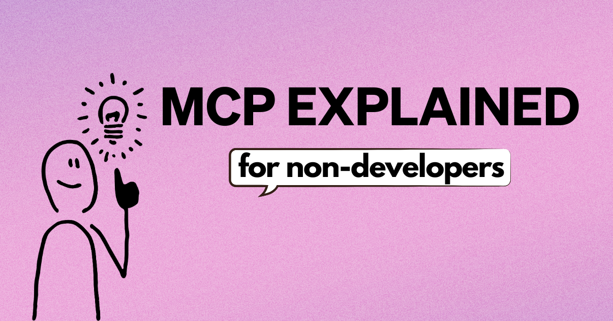

MCP this, MCP that, what exactly is it, and can you use them if you're not a developer? 🤔

<!--truncate-->

## What is MCP?

MCP stands for [Model Context Protocol](https://modelcontextprotocol.io/introduction), an open standard created by Anthropic.

Let's say you're looking for ways to use AI at work to become more efficient and save as much time as possible. So you go off and learn about large language models (LLMs) like OpenAI or Claude, and start chatting with one. It's amazing being able to chat with AI and have it instantly answer questions or have it tell you how to do something, but how about getting the AI to do stuff for you?

Now there are AI agents, or AI assistants, that can take actions and make decisions for you. But in order to have your AI agent interact with your systems, like Google Drive, Asana, or Slack, there wasn't a standard way to do it. At least not without figuring it out from scratch each time you needed your AI agent to work with what you need it to work with. That's super tedious.

That's exactly where MCP comes in. Best part is, you don't need to be a developer to start using them! MCP essentially allows you to give AI agents access to your external systems without having to code. You can think of MCP as the connector for a system and your AI agent, or like the USB-C of AI integrations.

## Adding MCP Servers
The tool that connects AI agents to different apps and services so they can work together automatically is called an **MCP Server**. I'll walk you through how to add MCP Servers to your AI agent. For this example, we'll use Goose as our AI agent. To add an MCP to Goose:
1. [Install Goose](https://block.github.io/goose/docs/getting-started/installation), then [configure the LLM of your choice](https://block.github.io/goose/docs/getting-started/providers) (OpenAI, Anthropic, etc.).
2. Pick the MCP server you want to use and view its installation instructions.
3. Add it to your AI agent. In Goose, you can add MCP servers under [Settings > Extensions](https://block.github.io/goose/docs/getting-started/using-extensions).)
4. Enable the MCP server.

Once set up, your AI agent will automatically use the MCP server for each task. Now whether it's files on your computer, a browser you have open, a Google Sheet of marketing data, or anything else, your AI agent can now use MCP servers to communicate with practically anything you need.

# MCP Servers You Should Try Right Now
So what MCP servers are out there, and which ones should I try first? With [over 3000 MCP servers](https://glama.ai/mcp/servers) you can connect to, here is your top list of popular MCP servers you should try:

- **[Google Drive](https://github.com/rishipradeep-think41/drive-mcp)**: File access and search capabilities for Google Drive
- **[Slack](https://github.com/modelcontextprotocol/servers/tree/main/src/slack)**: Channel management and messaging capabilities
- **[Google Maps](https://github.com/modelcontextprotocol/servers/tree/main/src/google-maps)**: Location services, directions, and place details
- **[Tavily Web Search](https://github.com/RamXX/mcp-tavily)**: Web and local search using Tavily's Search API
- **[Asana](https://github.com/roychri/mcp-server-asana)**: View asana tasks, projects, workspaces, and/or comments
- **[Speech](https://github.com/Kvadratni/speech-mcp)**: Real-time voice interaction, audio/video transcription, text-to-speech conversion and more
- **[Git](https://github.com/modelcontextprotocol/servers/tree/main/src/git)**: Tools to read, search, and manipulate Git repositories
- **[Fetch](https://github.com/modelcontextprotocol/servers/tree/main/src/fetch)**: Web content fetching and conversion for efficient LLM usage

This quick list should give you an idea of all the ways you can now use AI agents with your workflow. You can also explore community favorites in [handy MCP directories](https://dev.to/techgirl1908/my-favorite-mcp-directories-573n), or check out these [Goose tutorials](https://block.github.io/goose/docs/category/tutorials) showing you exactly how you can use some of these popular MCP servers with Goose. You can even use [Goose's Tutorial extension](https://block.github.io/goose/docs/tutorials/tutorial-extension) to get extra help walking you through using extensions or building them.

# The Possibilities Are Endless
While some are developed by official providers, a vast majority of MCP servers you see are actually developed by community members! Plus, because MCP is an open standard, anyone can build an MCP server for any resource. You could even use Goose to help you build one!

Hopefully now, instead of spending hours manually gathering data and creating your next marketing report, or manually sorting through your todo-backlog on a Monday, you will use MCP with Goose and have it done for you in minutes.

*To learn more about using MCP servers and Goose, check out the [Goose documentation](https://block.github.io/goose/docs/category/getting-started), or join the [Block Open Source Discord](https://discord.gg/block-opensource) to connect with other open source community members.*

<head>
  <meta property="og:title" content="MCP Explained for Non-Developers" />
  <meta property="og:type" content="article" />
  <meta property="og:url" content="https://block.github.io/goose/blog/2025/03/28/mcp-nondevs" />
  <meta property="og:description" content="Learn what MCP or Model Context Protocol is and how anyone can use it to save time on tasks." />
  <meta property="og:image" content="http://block.github.io/goose/assets/images/mcp_nondevs-5ce7f39de923cab01de6e14e5dc06744.png" />
  <meta name="twitter:card" content="summary_large_image" />
  <meta property="twitter:domain" content="block.github.io/goose" />
  <meta name="twitter:title" content="MCP Explained for Non-Developers" />
  <meta name="twitter:description" content="Learn what MCP or Model Context Protocol is and how anyone can use it to save time on tasks." />
  <meta name="twitter:image" content="http://block.github.io/goose/assets/images/mcp_nondevs-5ce7f39de923cab01de6e14e5dc06744.png" />
</head>