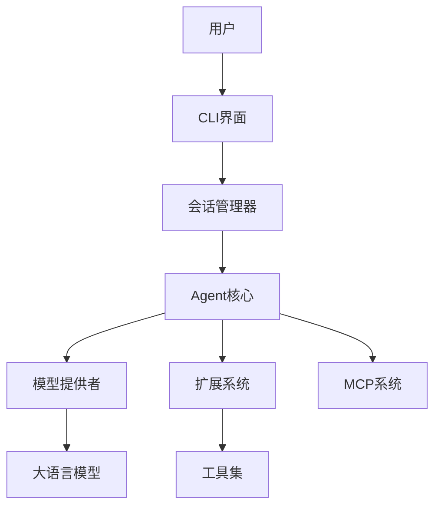
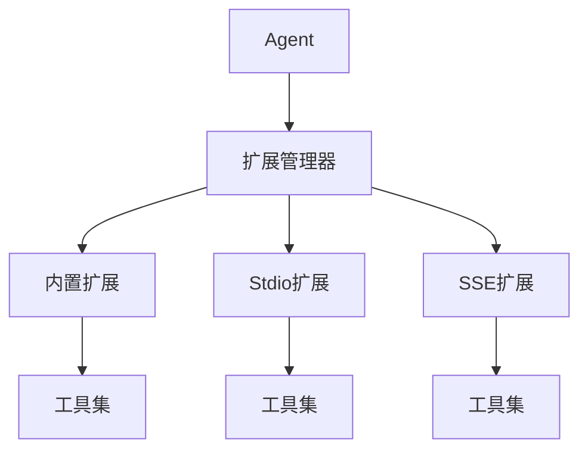
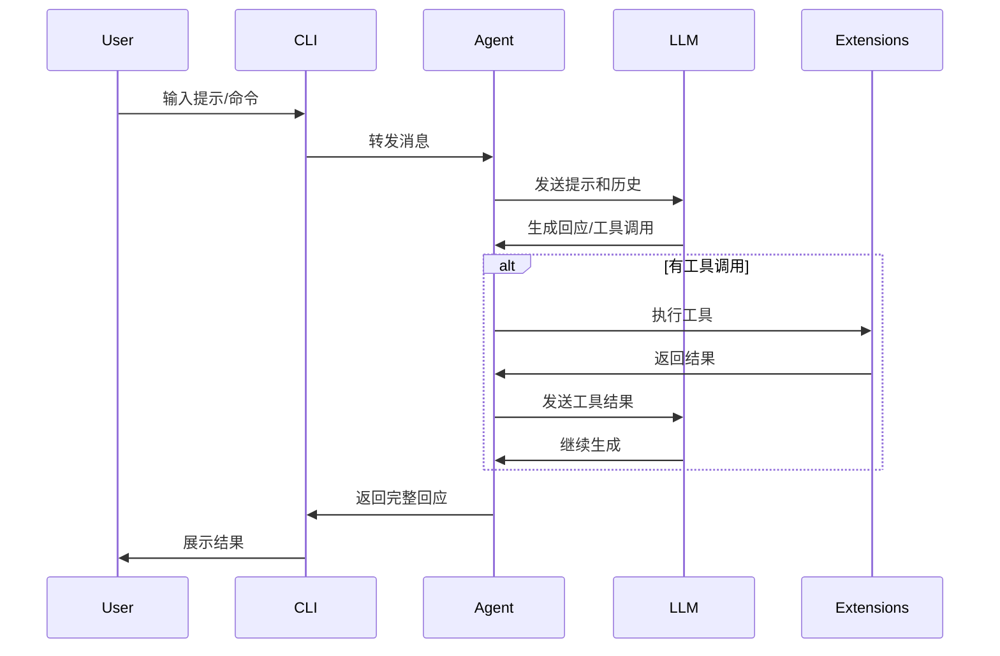
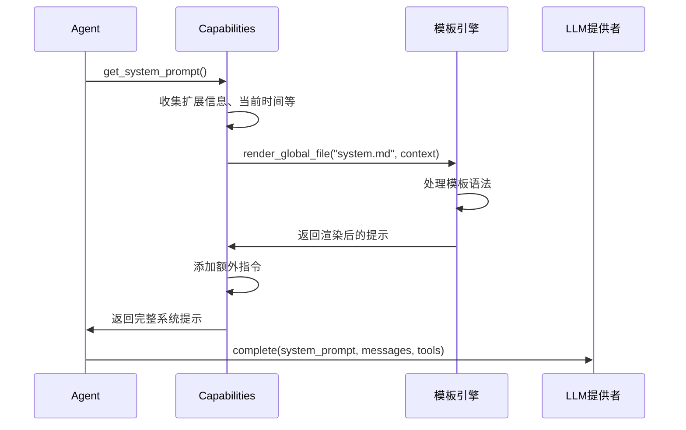

# Goose LLM 代理架构分析

## 1. 总体架构概述

Goose 是一个本地运行、可扩展的 AI 代理系统，专注于自动化工程任务。它的核心特点是：

- **扩展性强**: 通过插件系统增加功能
- **工具驱动**: 使用工具来执行各种任务
- **本地执行**: 在用户机器上运行
- **LLM 协作**: 与多种 LLM 模型兼容
- **状态管理**: 维护会话和执行状态



## 2. 核心组件分析

### 2.1 Agent 组件

Agent 是系统的核心，负责管理与 LLM 的交互，处理会话流，并协调工具调用。

```rust
pub trait Agent: Send + Sync {
    async fn reply(&self, messages: &[Message], session: Option<SessionConfig>) -> Result<BoxStream<'_, Result<Message>>>;
    async fn add_extension(&mut self, config: ExtensionConfig) -> ExtensionResult<()>;
    // 其他方法...
}
```

关键职责：
- 处理用户消息
- 管理多轮对话
- 集成和管理扩展
- 协调工具调用
- 维护系统提示

### 2.2 扩展系统

扩展系统允许通过插件方式添加新功能。Goose 支持三种类型的扩展：

1. **内置扩展**: 直接编译到二进制文件中
2. **Stdio 扩展**: 通过命令行接口通信
3. **SSE (Server-Sent Events) 扩展**: 通过 HTTP 连接的扩展



每个扩展提供：
- 工具定义
- 指令字符串
- 可能的资源访问

### 2.3 工具调用机制

工具是代理与外部世界交互的主要方式：

```rust
pub struct Tool {
    pub name: String,
    pub description: String,
    pub input_schema: Value,
}

pub struct ToolCall {
    pub name: String,
    pub arguments: Value,
}
```

工具调用流程：
1. LLM 决定调用某个工具
2. 系统找到相应的扩展处理该工具
3. 扩展执行工具并返回结果
4. 结果被发送回 LLM 进行下一步处理

### 2.4 MCP (Model-Client-Provider) 系统

MCP 是 Goose 的核心架构模式，将系统分为三个部分：

1. **Model**: 提供智能决策 (LLM)
2. **Client**: 连接模型和提供者
3. **Provider**: 执行实际功能

这种设计使得 Goose 可以适配不同的 LLM 提供商。

### 2.5 会话管理

会话管理器负责：
- 持久化对话历史
- 管理会话状态
- 处理会话恢复

它使用 JSONL 格式存储会话历史，允许简单地恢复之前的对话。

### 2.6 配置系统

配置系统允许用户自定义：
- 使用哪个 LLM 模型
- 加载哪些扩展
- 设置各种参数

## 3. 数据流分析



## 4. 主要设计模式

1. **工厂模式**: 用于创建不同类型的代理
2. **策略模式**: 允许选择不同的提供者
3. **观察者模式**: 用于通知系统状态变化
4. **装饰器模式**: 扩展功能而不修改核心代码
5. **依赖注入**: 为扩展提供所需依赖

## 5. 复现架构的关键步骤

1. **定义核心接口**:
   - 创建 Agent 接口
   - 设计 Tool 和 ToolCall 数据结构
   - 定义 Extension 接口

2. **实现消息流处理**:
   - 创建消息结构
   - 实现流式处理机制
   - 处理会话状态

3. **构建扩展系统**:
   - 实现扩展注册机制
   - 创建扩展加载器
   - 设计扩展交互协议

4. **设计工具调用系统**:
   - 创建工具注册机制
   - 实现工具调用解析
   - 处理工具执行结果

5. **集成 LLM 提供者**:
   - 创建提供者接口
   - 实现具体提供者适配器
   - 设计提示格式化机制

6. **构建用户界面**:
   - 实现命令行界面
   - 设计交互模式
   - 处理用户输入

## 6. 核心概念总结

- **Agent**: 系统的核心协调者
- **Extension**: 功能扩展模块
- **Tool**: 代理与外部世界交互的接口
- **Provider**: LLM 模型适配器
- **Session**: 对话状态管理器
- **Profile**: 用户配置管理器

这个架构非常灵活，可以在各种编程语言中实现。关键是理解组件之间的交互模式和数据流，然后根据您选择的语言特性来实现这些概念。

## 7. 提示词渲染机制分析

Goose 使用一个复杂而灵活的提示词渲染系统来与 LLM 进行交互。这个系统使用模板引擎来动态生成提示，根据当前上下文、加载的扩展和用户配置自定义 LLM 的行为。

### 7.1 模板引擎

Goose 使用 MiniJinja（一个轻量级的 Jinja2 兼容模板引擎）来渲染提示词模板：

```rust
static GLOBAL_ENV: Lazy<Arc<RwLock<Environment<'static>>>> = Lazy::new(|| {
    let mut env = Environment::new();
    
    // 预加载所有核心模板
    for file in CORE_PROMPTS_DIR.files() {
        let name = file.path().to_string_lossy().to_string();
        let source = String::from_utf8_lossy(file.contents()).to_string();
        
        // 确保模板字符串存活整个程序生命周期
        let static_name: &'static str = Box::leak(name.into_boxed_str());
        let static_source: &'static str = Box::leak(source.into_boxed_str());
        
        if let Err(e) = env.add_template(static_name, static_source) {
            tracing::error!("Failed to add template {}: {}", static_name, e);
        }
    }
    
    Arc::new(RwLock::new(env))
});
```

核心功能包括：

1. **嵌入式模板**：所有核心提示模板都嵌入到二进制文件中，确保它们始终可用
2. **全局环境**：维护一个全局模板环境，允许高效地重用模板
3. **动态渲染**：支持复杂的条件逻辑和循环，使模板能够适应各种情况
4. **上下文注入**：允许将变量和数据注入到模板中

### 7.2 提示模板类型

Goose 具有几种核心提示模板，每种都有特定的用途：

1. **系统提示 (system.md)**：定义 LLM 的身份、能力和行为准则
2. **计划提示 (plan.md)**：用于规划复杂任务的执行步骤
3. **测试/模拟提示 (mock.md)**：用于测试和开发

### 7.3 提示渲染过程

以系统提示为例，渲染过程如下：



### 7.4 渲染示例

让我们以具体例子展示 Goose 如何渲染系统提示：

**1. 创建上下文**：首先，创建包含所需数据的上下文对象：

```rust
let mut context: HashMap<&str, Value> = HashMap::new();

// 添加扩展信息
let extensions_info = vec![
    ExtensionInfo::new("filesystem", "用于读写文件的扩展", true),
    ExtensionInfo::new("web_search", "用于搜索网页的扩展", false)
];
context.insert("extensions", serde_json::to_value(extensions_info).unwrap());

// 添加当前时间
let current_date_time = "2025-03-25 11:05:00";
context.insert("current_date_time", Value::String(current_date_time.to_string()));
```

**2. 渲染模板**：使用上下文渲染模板：

```rust
let system_prompt = prompt_template::render_global_file("system.md", &context)
    .expect("Prompt should render");
```

**3. 渲染结果**：最终生成的提示可能如下所示：

```
You are a general-purpose AI agent called Goose, created by Block, the parent company of Square, CashApp, and Tidal. Goose is being developed as an open-source software project.

The current date is 2025-03-25 11:05:00.

Goose uses LLM providers with tool calling capability. You can be used with different language models (gpt-4o, claude-3.5-sonnet, o1, llama-3.2, deepseek-r1, etc).
These models have varying knowledge cut-off dates depending on when they were trained, but typically it's between 5-10 months prior to the current date.

# Extensions

Because you dynamically load extensions, your conversation history may refer
to interactions with extensions that are not currently active. The currently
active extensions are below. Each of these extensions provides tools that are
in your tool specification.

## filesystem
filesystem supports resources, you can use platform__read_resource,
and platform__list_resources on this extension.
### Instructions
用于读写文件的扩展

## web_search
### Instructions
用于搜索网页的扩展

# Response Guidelines

- Use Markdown formatting for all responses.
- Follow best practices for Markdown, including:
  - Using headers for organization.
  - Bullet points for lists.
  - Links formatted correctly, either as linked text (e.g., [this is linked text](https://example.com)) or automatic links using angle brackets (e.g., <http://example.com/>).
- For code examples, use fenced code blocks by placing triple backticks (` ``` `) before and after the code. Include the language identifier after the opening backticks (e.g., ` ```python `) to enable syntax highlighting.
- Ensure clarity, conciseness, and proper formatting to enhance readability and usability.

# Additional Instructions:

Right now you are *NOT* in the chat only mode and have access to tool use and system.
```

**4. 提供给 LLM**：最后，将这个系统提示与消息历史和可用工具一起发送给 LLM 提供者：

```rust
let (response, usage) = provider.complete(
    &system_prompt,  // 上面渲染的提示
    &messages,       // 对话历史
    &tools,          // 可用工具
).await?;
```

### 7.5 提示词渲染的关键特性

1. **动态扩展集成**：系统提示包含当前加载的所有扩展及其指令
2. **时间感知**：提示中包含当前日期时间，使 LLM 了解时间上下文
3. **条件逻辑**：提示根据当前配置（如聊天模式）调整内容
4. **资源支持指示**：告知 LLM 哪些扩展支持资源功能
5. **统一格式化准则**：确保 LLM 输出遵循一致的 Markdown 格式

这种灵活的提示渲染系统允许 Goose 在不修改核心代码的情况下适应不同的使用场景，并支持多种 LLM 提供者。