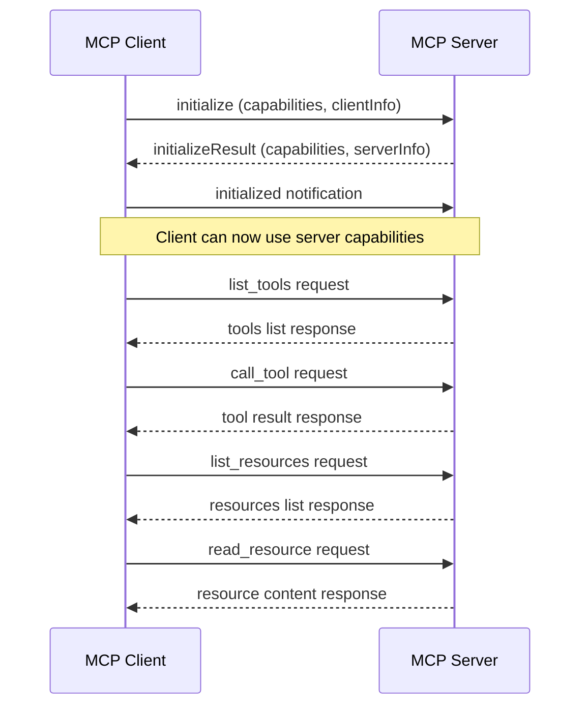
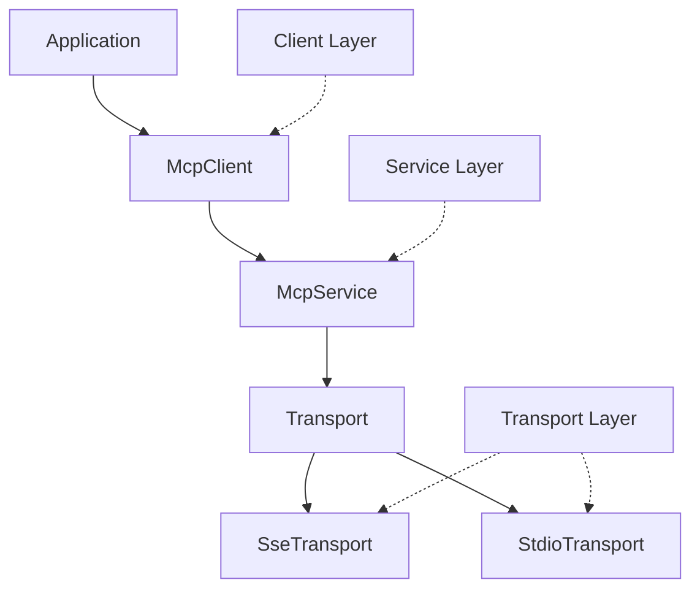
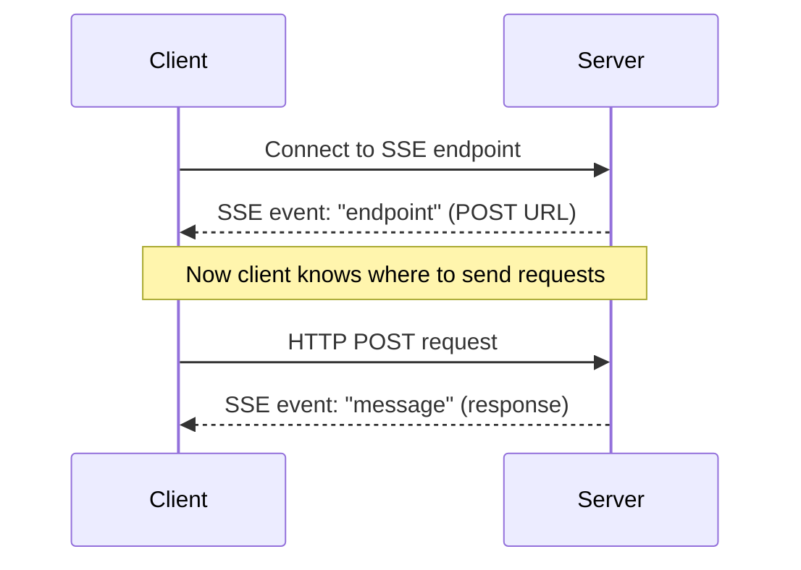
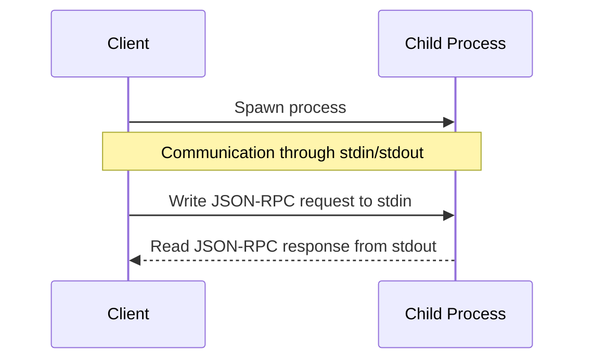

# MCP Client Implementation: Technical Analysis

This document provides a technical analysis of the Model Context Protocol (MCP) client implementation in the repository, focusing on protocol details, architectural patterns, and implementation strategies.

## 1. MCP Protocol Overview

The Model Context Protocol (MCP) is a JSON-RPC 2.0 based protocol designed for communication between AI model consumers (clients) and providers (servers). The implementation uses a bidirectional messaging system with the following characteristics:



### 1.1 Protocol Message Structure

All messages follow the JSON-RPC 2.0 specification:

```json
// Request
{
  "jsonrpc": "2.0",
  "id": 1,
  "method": "method_name",
  "params": { /* parameters */ }
}

// Response
{
  "jsonrpc": "2.0",
  "id": 1,
  "result": { /* result object */ }
}

// Error
{
  "jsonrpc": "2.0",
  "id": 1,
  "error": {
    "code": -32600,
    "message": "Invalid Request"
  }
}

// Notification
{
  "jsonrpc": "2.0",
  "method": "notification_name",
  "params": { /* parameters */ }
}
```

## 2. Architecture Deep Dive

The MCP client implementation follows a layered architecture:



### 2.1 Transport Layer

The transport layer handles the low-level communication between client and server.

#### 2.1.1 Transport Interface

```rust
#[async_trait]
pub trait Transport {
    type Handle: TransportHandle;
    async fn start(&self) -> Result<Self::Handle, Error>;
    async fn close(&self) -> Result<(), Error>;
}

#[async_trait]
pub trait TransportHandle: Send + Sync + Clone + 'static {
    async fn send(&self, message: JsonRpcMessage) -> Result<JsonRpcMessage, Error>;
}
```

#### 2.1.2 Implementation Pattern

Both transports (SSE and STDIO) follow the **actor pattern**:

1. **Actor Initialization**:
   - Create channels for message passing
   - Initialize connection resources
   - Spawn background tasks for message handling

2. **Message Dispatching**:
   - Outgoing messages are sent through a channel to the actor
   - The actor serializes messages and sends them to the server
   - For requests (not notifications), a oneshot channel is created for the response

3. **Message Receiving**:
   - A background task continuously reads from the transport
   - Received messages are parsed and matched with pending requests
   - Responses are sent back through the corresponding oneshot channel

4. **Request Tracking**:
   - `PendingRequests` maintains a map of request IDs to response channels
   - When a response is received, the corresponding channel is retrieved and used

### 2.2 Service Layer

The service layer adapts the transport to the Tower service interface.

#### 2.2.1 Service Interface

```rust
impl<T> Service<JsonRpcMessage> for McpService<T>
where
    T: TransportHandle + Send + Sync + 'static,
{
    type Response = JsonRpcMessage;
    type Error = Error;
    type Future = BoxFuture<'static, Result<Self::Response, Self::Error>>;

    fn poll_ready(&mut self, _cx: &mut Context<'_>) -> Poll<Result<(), Self::Error>> {
        Poll::Ready(Ok(()))
    }

    fn call(&mut self, request: JsonRpcMessage) -> Self::Future {
        let transport = self.inner.clone();
        Box::pin(async move { transport.send(request).await })
    }
}
```

#### 2.2.2 Tower Service Pattern

The implementation uses Tower's Service trait, which enables:

1. **Middleware Composition**:
   - Services can be wrapped with middleware like timeout, retry, etc.
   - Example: `McpService::with_timeout()` adds timeout behavior

2. **Backpressure Handling**:
   - The `poll_ready` method can signal when the service is not ready to accept more requests
   - Important for flow control in high-load scenarios

### 2.3 Client Layer

The client layer provides a high-level API for MCP operations.

#### 2.3.1 Client Interface

```rust
#[async_trait]
pub trait McpClientTrait: Send + Sync {
    async fn initialize(&mut self, info: ClientInfo, capabilities: ClientCapabilities) 
        -> Result<InitializeResult, Error>;
    async fn list_resources(&self, next_cursor: Option<String>) 
        -> Result<ListResourcesResult, Error>;
    async fn read_resource(&self, uri: &str) 
        -> Result<ReadResourceResult, Error>;
    async fn list_tools(&self, next_cursor: Option<String>) 
        -> Result<ListToolsResult, Error>;
    async fn call_tool(&self, name: &str, arguments: Value) 
        -> Result<CallToolResult, Error>;
    async fn list_prompts(&self, next_cursor: Option<String>) 
        -> Result<ListPromptsResult, Error>;
    async fn get_prompt(&self, name: &str, arguments: Value) 
        -> Result<GetPromptResult, Error>;
}
```

#### 2.3.2 Request-Response Pattern

1. **Request Preparation**:
   - Generate unique request ID
   - Serialize parameters to JSON
   - Construct JSON-RPC request

2. **Service Interaction**:
   - Acquire mutex lock on service
   - Call service with the request
   - Handle transport errors

3. **Response Processing**:
   - Validate response matches request ID
   - Check for JSON-RPC errors
   - Deserialize result into expected type

4. **Capability Checking**:
   - Check if server supports requested operation
   - Return appropriate error if capability not supported

## 3. Transport Implementations

### 3.1 SSE Transport

The SSE (Server-Sent Events) transport uses HTTP for bidirectional communication:



#### 3.1.1 Key Components

1. **Connection Setup**:
   - Connect to SSE endpoint using `eventsource-client`
   - Wait for "endpoint" event to discover POST URL
   - Establish HTTP client for sending requests

2. **Sending Messages**:
   - Serialize JSON-RPC message
   - Send via HTTP POST to discovered endpoint
   - Store request in pending requests map if it expects a response

3. **Receiving Messages**:
   - Listen for SSE events of type "message"
   - Parse event data as JSON-RPC message
   - Match with pending request and send response

### 3.2 STDIO Transport

The STDIO transport communicates with a child process through stdin/stdout:



#### 3.2.1 Key Components

1. **Process Management**:
   - Spawn child process with piped stdin/stdout/stderr
   - Configure process for platform-specific behavior
   - Handle process exit gracefully

2. **Sending Messages**:
   - Serialize JSON-RPC message
   - Write to process stdin with newline termination
   - Flush to ensure immediate delivery

3. **Receiving Messages**:
   - Read lines from process stdout using `BufReader`
   - Parse line as JSON-RPC message
   - Match with pending request and send response

4. **Error Handling**:
   - Monitor process stderr for error messages
   - Signal errors through dedicated error channel
   - Clean up pending requests on process termination

## 4. Resource and Tool Implementation

### 4.1 Resources

Resources represent content that can be accessed by the client. The implementation provides:

```rust
#[derive(Debug, Serialize, Deserialize, Clone, PartialEq)]
#[serde(rename_all = "camelCase")]
pub struct Resource {
    pub uri: String,
    pub name: String,
    #[serde(skip_serializing_if = "Option::is_none")]
    pub description: Option<String>,
    #[serde(default = "default_mime_type")]
    pub mime_type: String,
    #[serde(skip_serializing_if = "Option::is_none")]
    pub annotations: Option<Annotations>,
}
```

#### 4.1.1 Resource Management

1. **Resource Creation**:
   - Resources are identified by URIs (e.g., "file:///path/to/file")
   - MIME types indicate content type ("text" or "blob")
   - Annotations provide metadata like priority and timestamp

2. **Resource Contents**:
   - TextResourceContents for text-based content
   - BlobResourceContents for binary content (as base64)

### 4.2 Tools

Tools represent functions that can be called by the client:

```rust
#[derive(Debug, Clone, PartialEq, Serialize, Deserialize)]
#[serde(rename_all = "camelCase")]
pub struct Tool {
    pub name: String,
    pub description: String,
    pub input_schema: Value, // JSON Schema
}
```

#### 4.2.1 Tool Invocation

1. **Tool Discovery**:
   - Client lists available tools from server
   - Each tool includes input schema for parameter validation

2. **Tool Calling**:
   - Client constructs arguments based on input schema
   - Server executes tool and returns results
   - Results include content and optional error flag

## 5. Error Handling Patterns

The implementation uses a comprehensive error handling approach:

### 5.1 Error Hierarchy

```rust
#[derive(Debug, Error)]
pub enum Error {
    #[error("Transport error: {0}")]
    Transport(#[from] super::transport::Error),

    #[error("RPC error: code={code}, message={message}")]
    RpcError { code: i32, message: String },
    
    // Other error variants...
}
```

### 5.2 Error Propagation

1. **Transport Errors**:
   - Low-level communication errors
   - Converted to client errors with context

2. **Protocol Errors**:
   - JSON-RPC error responses from server
   - Parsed into structured error types

3. **Application Errors**:
   - Capability mismatches
   - Serialization/deserialization errors
   - Timeout errors

### 5.3 Error Recovery

1. **Connection Errors**:
   - Clear pending requests on connection failure
   - Signal errors to waiting callers

2. **Request Errors**:
   - Return structured error type to caller
   - Include context about the failed operation

## 6. Implementation Techniques for Custom Clients

When implementing your own MCP client, consider these techniques from this codebase:

### 6.1 Modular Transport Layer

- **Trait-Based Design**: Define clear interfaces for transport mechanisms
- **Pluggable Architecture**: Allow different transport implementations
- **Adapter Pattern**: Convert specific transports to common interface

### 6.2 Async Communication Patterns

- **Channel-Based Messaging**: Use channels for internal communication
- **Actor Pattern**: Separate concerns for message handling
- **Request-Response Pairing**: Track and match requests with responses

### 6.3 Service Abstractions

- **Middleware Support**: Design for composition of features
- **Backpressure Handling**: Include mechanisms for flow control
- **Error Propagation**: Consistently handle and propagate errors

## 7. Conclusion

The MCP client implementation demonstrates several advanced patterns for building robust client applications:

1. **Layered Architecture**: Clear separation of concerns
2. **Asynchronous Processing**: Non-blocking operations throughout
3. **Protocol Encapsulation**: Hiding JSON-RPC details from users
4. **Pluggable Transports**: Multiple communication methods
5. **Comprehensive Error Handling**: Clear error categorization and context

These patterns can be adapted to other languages and environments while maintaining the same architectural principles. When building your own MCP client, focus on these key areas to ensure a robust and maintainable implementation.