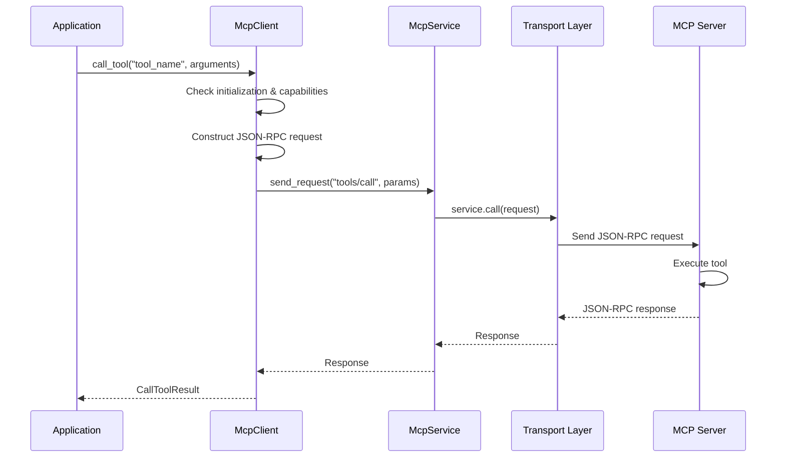

# MCP Client Tool Calling Implementation

This document explores the client-side implementation for calling tools in the MCP architecture, focusing on how the MCP client interacts with tool implementations on the server.

## 1. Client-Side Tool Calling Method

The central method for tool calling is the `call_tool` method in the `McpClient` class, implemented in `crates/mcp-client/src/client.rs`:

```rust
async fn call_tool(&self, name: &str, arguments: Value) -> Result<CallToolResult, Error> {
    if !self.completed_initialization() {
        return Err(Error::NotInitialized);
    }
    // If tools is not supported, return an error
    if self.server_capabilities.as_ref().unwrap().tools.is_none() {
        return Err(Error::RpcError {
            code: METHOD_NOT_FOUND,
            message: "Server does not support 'tools' capability".to_string(),
        });
    }

    let params = serde_json::json!({ "name": name, "arguments": arguments });

    // TODO ERROR: check that if there is an error, we send back is_error: true with msg
    // https://modelcontextprotocol.io/docs/concepts/tools#error-handling-2
    self.send_request("tools/call", params).await
}
```

This method is part of the `McpClientTrait` implementation for `McpClient<S>`. It:

1. Verifies the client has been initialized (`completed_initialization()`)
2. Checks if the server supports the 'tools' capability
3. Constructs a JSON-RPC request with the tool name and arguments
4. Sends the request to the server using the internal `send_request` method

## 2. Request Flow for Tool Calling

When a client calls a tool, the request follows this flow:



## 3. The `send_request` Method

The internal `send_request` method handles the JSON-RPC request creation and response processing:

```rust
async fn send_request<R>(&self, method: &str, params: Value) -> Result<R, Error>
where
    R: for<'de> Deserialize<'de>,
{
    let mut service = self.service.lock().await;
    service.ready().await.map_err(|_| Error::NotReady)?;

    let id = self.next_id.fetch_add(1, Ordering::SeqCst);
    let request = JsonRpcMessage::Request(JsonRpcRequest {
        jsonrpc: "2.0".to_string(),
        id: Some(id),
        method: method.to_string(),
        params: Some(params.clone()),
    });

    let response_msg = service
        .call(request)
        .await
        .map_err(|e| Error::McpServerError {
            server: self
                .server_info
                .as_ref()
                .map(|s| s.name.clone())
                .unwrap_or("".to_string()),
            method: method.to_string(),
            source: Box::new(e.into()),
        })?;

    // Process response...
    // (Response processing logic follows)
}
```

This method:
1. Acquires a lock on the service
2. Ensures the service is ready to accept requests
3. Generates a unique request ID
4. Constructs a JSON-RPC request
5. Sends the request through the service layer
6. Processes and deserializes the response

## 4. Tool Call Result Structure

The tool call returns a `CallToolResult` structure defined in the protocol:

```rust
#[derive(Debug, Serialize, Deserialize)]
#[serde(rename_all = "camelCase")]
pub struct CallToolResult {
    pub content: Vec<Content>,
    #[serde(skip_serializing_if = "Option::is_none")]
    pub is_error: Option<bool>,
}
```

Where `Content` can represent different types of content (text, images, etc.) returned by the tool.

## 5. Client Usage Example

Here's how an application would use the MCP client to call a tool:

```rust
// Create and initialize client
let transport = SseTransport::new("http://localhost:8000/sse", HashMap::new());
let handle = transport.start().await?;
let service = McpService::with_timeout(handle, Duration::from_secs(3));
let mut client = McpClient::new(service);

// Initialize the client
client.initialize(
    ClientInfo {
        name: "my-client".into(),
        version: "1.0.0".into(),
    },
    ClientCapabilities::default(),
).await?;

// Call the tool
let result = client
    .call_tool(
        "example_tool",
        serde_json::json!({
            "param1": "value1",
            "param2": 42
        }),
    )
    .await?;

// Process the result
for content in result.content {
    match content {
        Content::Text { text } => println!("Tool returned text: {}", text),
        // Handle other content types...
    }
}
```

## 6. Error Handling

The client handles several error scenarios when calling tools:

1. **Client Not Initialized**: Returns `Error::NotInitialized` if the client hasn't completed initialization
2. **Capability Missing**: Returns `Error::RpcError` if the server doesn't support tool capability
3. **Transport Errors**: Propagates errors from the transport layer
4. **Server Errors**: Processes JSON-RPC error responses from the server
5. **Deserialization Errors**: Handles errors when parsing the response

## 7. Relationship with Server-Side Implementation

While the client implements the calling mechanism, the actual tool execution happens on the server side:

1. Client sends a JSON-RPC request to the `tools/call` method
2. Server locates the tool implementation using the provided name
3. Server validates arguments against the tool's schema
4. Server invokes the tool's `call` method with the arguments
5. Server collects the result and returns it to the client

The client doesn't need to know the details of how tools are implemented on the server; it only needs to know:
- The tool name
- The expected argument structure
- How to interpret the results

## 8. Implementation Considerations for Custom Clients

When implementing your own MCP client for tool calling, consider:

1. **Capability Negotiation**: Check if the server supports tools before attempting calls
2. **Parameter Validation**: Consider validating parameters client-side before sending
3. **Error Handling**: Implement comprehensive error handling for different failure modes
4. **Response Processing**: Design a clean API for processing tool results
5. **Type Safety**: Consider generating type-safe wrappers for known tools

By following these patterns, you can create a robust tool calling implementation in your custom MCP client.