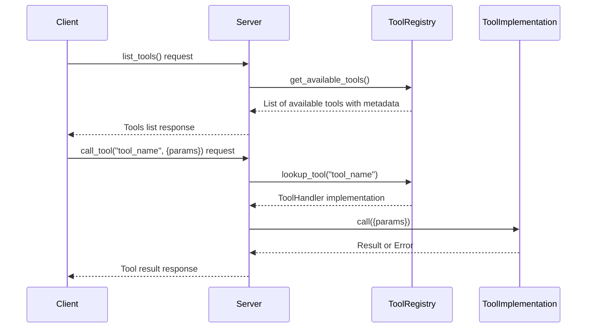

# MCP Tool Execution Implementation

This document focuses specifically on how tool execution is implemented in the MCP architecture, particularly the server-side implementation of tools and how clients interact with them.

## 1. Tool Handler Interface

The core of tool execution in the MCP implementation is the `ToolHandler` trait defined in `crates/mcp-core/src/handler.rs`:

```rust
#[async_trait]
pub trait ToolHandler: Send + Sync + 'static {
    /// The name of the tool
    fn name(&self) -> &'static str;

    /// A description of what the tool does
    fn description(&self) -> &'static str;

    /// JSON schema describing the tool's parameters
    fn schema(&self) -> Value;

    /// Execute the tool with the given parameters
    async fn call(&self, params: Value) -> ToolResult<Value>;
}
```

This trait defines the contract that any MCP tool implementation must fulfill:

1. **Tool Identity**: The `name()` and `description()` methods provide metadata about the tool
2. **Parameter Schema**: The `schema()` method returns a JSON Schema that describes valid parameters
3. **Execution Logic**: The `call()` method contains the actual implementation logic of the tool

## 2. Tool Error Handling

Tool execution can result in various errors, which are handled through a specialized error type:

```rust
#[non_exhaustive]
#[derive(Error, Debug, Clone, Deserialize, Serialize, PartialEq)]
pub enum ToolError {
    #[error("Invalid parameters: {0}")]
    InvalidParameters(String),
    #[error("Execution failed: {0}")]
    ExecutionError(String),
    #[error("Schema error: {0}")]
    SchemaError(String),
    #[error("Tool not found: {0}")]
    NotFound(String),
}

pub type ToolResult<T> = std::result::Result<T, ToolError>;
```

This error type provides structured error reporting for:
- Parameter validation failures
- Execution errors during tool operation
- Schema-related errors
- Tool resolution errors

## 3. Client-Server Tool Interaction

The interaction between client and server for tool execution follows this sequence:



## 4. Tool Registration and Discovery

Tools must be registered with an MCP server in order to be discoverable and callable by clients. The implementation follows these patterns:

1. **Tool Registration**: Tools are implemented by creating structs that implement the `ToolHandler` trait
2. **Tool Registry**: A registry component maintains a collection of available tools
3. **Discovery Mechanism**: The `list_tools` method exposes available tools to clients
4. **Parameter Validation**: When a tool is called, parameters are validated against the tool's schema

## 5. Implementing a Tool

To implement a tool, you create a struct that implements the `ToolHandler` trait:

```rust
struct ExampleTool;

#[async_trait]
impl ToolHandler for ExampleTool {
    fn name(&self) -> &'static str {
        "example_tool"
    }
    
    fn description(&self) -> &'static str {
        "An example tool that demonstrates tool implementation"
    }
    
    fn schema(&self) -> Value {
        serde_json::json!({
            "type": "object",
            "properties": {
                "input": {
                    "type": "string",
                    "description": "The input string"
                }
            },
            "required": ["input"]
        })
    }
    
    async fn call(&self, params: Value) -> ToolResult<Value> {
        // Extract parameters
        let input = match params.get("input") {
            Some(v) => v.as_str().ok_or_else(|| {
                ToolError::InvalidParameters("Input must be a string".to_string())
            })?,
            None => return Err(ToolError::InvalidParameters("Missing input".to_string())),
        };
        
        // Perform tool logic
        let result = format!("Processed: {}", input);
        
        // Return result
        Ok(serde_json::json!({ "result": result }))
    }
}
```

## 6. Client Tool Invocation

From the client side, tool invocation follows this pattern:

```rust
// Assume we have a properly initialized MCP client
let client = McpClient::new(service);

// First, initialize the connection
client.initialize(
    ClientInfo {
        name: "my-client".into(),
        version: "1.0.0".into(),
    },
    ClientCapabilities::default(),
).await?;

// List available tools
let tools = client.list_tools(None).await?;
println!("Available tools: {:?}", tools);

// Call a specific tool with parameters
let tool_result = client
    .call_tool(
        "example_tool",
        serde_json::json!({ "input": "Hello, world!" }),
    )
    .await?;

// Process the result
println!("Tool result: {:?}", tool_result);
```

## 7. Schema Handling Helper

The implementation includes a helper function to generate JSON schema from Rust types using schemars:

```rust
pub fn generate_schema<T: JsonSchema>() -> ToolResult<Value> {
    let schema = schemars::schema_for!(T);
    serde_json::to_value(schema).map_err(|e| ToolError::SchemaError(e.to_string()))
}
```

This allows tool implementations to:
1. Define request/response types as Rust structs
2. Automatically generate JSON schema for parameter validation
3. Ensure type safety between schema and implementation

## 8. Tool Results

When a tool executes successfully, it returns a `ToolResult<Value>` which is a JSON value. The server wraps this in a `CallToolResult`:

```rust
#[derive(Debug, Serialize, Deserialize)]
#[serde(rename_all = "camelCase")]
pub struct CallToolResult {
    pub content: Vec<Content>,
    #[serde(skip_serializing_if = "Option::is_none")]
    pub is_error: Option<bool>,
}
```

This structured format allows:
- Returning complex data structures
- Indicating errors in a standardized way
- Including multiple content pieces (text, images, etc.)

## 9. Implementation Considerations for Custom Tool Execution

When implementing your own MCP tool execution system, consider these aspects:

1. **Tool Registration Mechanism**: How tools are registered with the server
2. **Parameter Validation**: How tool parameters are validated against schemas
3. **Error Handling**: How errors are communicated back to clients
4. **Asynchronous Execution**: How long-running tools are handled
5. **Security Considerations**: How to prevent misuse of tools
6. **Resource Limitations**: How to manage system resources during tool execution

By carefully considering these aspects, you can create a robust and flexible tool execution system that meets your specific requirements.